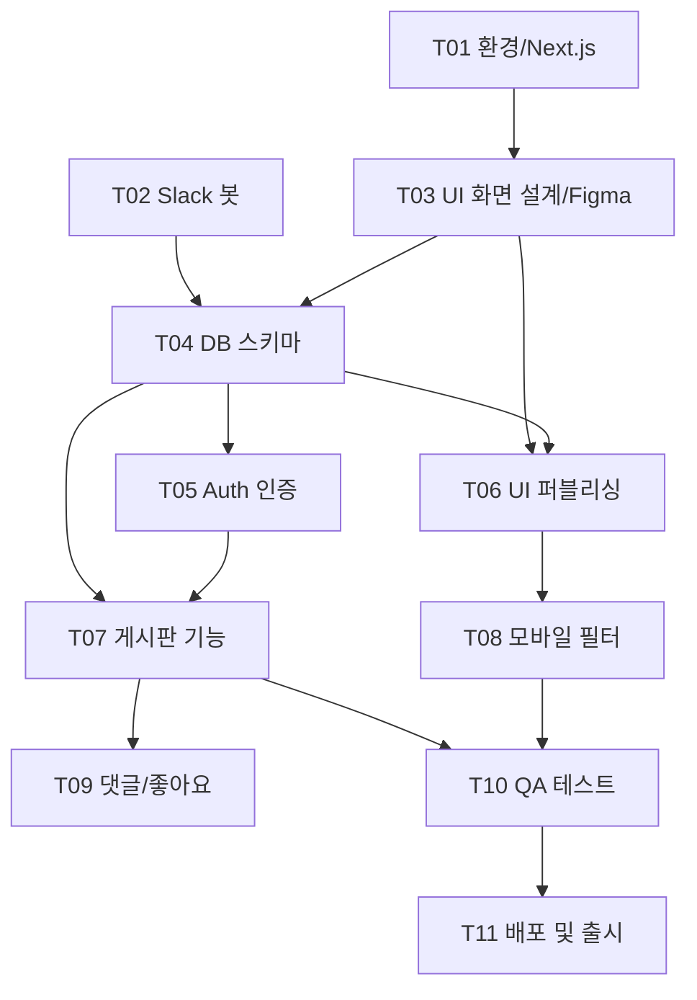

# 📊 7월 인라인 커뮤니티 앱 개발 WBS (Work Breakdown Structure)

> **기준 문서:** [PRD.md](./PRD.md) · [daily_report.md](./daily_report.md)  
> **작성자:** 비비안  
> **프로젝트 기간:** 2026. 07. 01 ~ 2026. 07. 31 (평일 및 주말 포함 린 개발 기준)  
> **최종 수정:** 2026-07-05 (디자인/화면 설계 단계 긴급 반영 보완본)

---

## 진척도 관리

- **행 단위 `계획(%)` / `실적(%)`:** 해당 작업 항목 자체의 완료율 (0~100%)
- **프로젝트 누적(%):** 각 행 `실적(%)` × **가중치** 합산 → [daily_report.md](./daily_report.md) 참고
- **일일 보고:** 완료·진행 Task ID → `reports/YYYY-MM-DD.md` 생성 · [daily_report.md](./daily_report.md) 대시보드 갱신

**범례:** `[ ]` 미착수 · `[~]` 진행 중 · `[x]` 완료

---

## WBS 마스터 테이블

| ID | 주차 | 해당 날짜 | 작업 항목 | 상세 작업 항목 | 우선순위 | 담당 | 가중치 | 계획(%) | 실적(%) | 상태 |
|:---|:-----|:----------|:----------|:---------------|:------:|:-----|:------:|:------:|:------:|:----:|
| **T01** | W1 | 7/1 ~ 7/3 | 환경 설정 | GitHub - Cursor 연동 및 초기 Next.js 프로젝트 생성 | P1 | 비비안 + Gemini + Claude | 9% | 100 | 100 | [x] |
| **T02** | W1 | 7/1 ~ 7/3 | 환경 설정 | Slack API 연동 및 아침 9시 데일리 크롤링 보고 봇 생성 | P1 | 비비안 + Gemini + Claude | 9% | 100 | 100 | [x] |
| **T03** | W1.5 | 7/4 ~ 7/7 | 화면 설계 | 핵심 화면(홈, 상세, 피드) 와이어프레임 및 피그마 GUI 컴포넌트 설계 | P1 | 비비안 + Gemini | 9% | 75 | 82 | [~] |
| **T04** | W2 | 7/6 ~ 7/7 | DB 설계 | 인라인 경기장, 경기 정보, 게시글 저장을 위한 Supabase DB 스키마 설계 | P1 | 비비안 + Gemini + Claude | 9% | 0 | 0 | [ ] |
| **T05** | W2 | 7/8 ~ 7/12 | 인증 구현 | Supabase Auth 기반 소셜 로그인(카카오/이메일) UI 및 기능 구현 | P1 | 비비안 + Gemini + Claude | 9% | 0 | 0 | [ ] |
| **T06** | W2 | 7/8 ~ 7/12 | UI 퍼블리싱 | 인라인 경기장 목록 및 세부 경기 정보 카드 UI 화면 구현 | P1 | 비비안 + Gemini + Claude | 9% | 0 | 0 | [ ] |
| **T07** | W3 | 7/13 ~ 7/17 | 기능 개발 | 커뮤니티 자유게시판 피드 생성/조회 및 데이터 연동 | P1 | 비비안 + Gemini + Claude | 9% | 0 | 0 | [ ] |
| **T08** | W3 | 7/13 ~ 7/17 | UI 기능 고도화 | 모바일 최적화 정렬/필터 드롭다운 메뉴 상태 관리 구현 | P1 | 비비안 + Gemini + Claude | 9% | 0 | 0 | [ ] |
| **T09** | W4 | 7/20 ~ 7/24 | 상호작용 개발 | [선택] 게시글 하단 댓글 및 좋아요(하트) 토글 기능 추가 | P2 | 비비안 + Gemini + Claude | 9% | 0 | 0 | [ ] |
| **T10** | W4 | 7/20 ~ 7/24 | 테스트 (QA) | 전체 유저 시나리오 기반 기능 테스트 및 버그 픽 (클로즈 베타) | P1 | 비비안 + Gemini + Claude | 10% | 0 | 0 | [ ] |
| **T11** | W5 | 7/27 ~ 7/31 | 배포 및 출시 | GitHub 최종 푸시 및 Vercel / 웹뷰 패키징을 통한 최종 앱 배포 | P1 | 비비안 + Gemini + Claude | 10% | 0 | 0 | [ ] |

> **7/5 기준:** T01·T02 100% · T03 **82%** (34화면 라우트 뼈대 · ROUTE_MAP · shadcn Button 검증) · T04 DB 이월  
> **아키텍처:** 루트 `app/` 구조 최종 확정 (`src/` 미사용)

---

## 주차별 마일스톤

| 주차 | 날짜 | 마일스톤 | 핵심 Task |
|:----:|:-----|:---------|:----------|
| **W1** | 7/1 – 7/5 | 🎯 **기반 구축 & 초기 기획** | T01, T02 |
| **W1.5** | 7/6 – 7/7 | 🎨 **화면 설계 & UI 가이드라인** | T03, T04 |
| **W2** | 7/8 – 7/12 | 🔐 **인증 & 핵심 UI 퍼블리싱** | T05, T06 |
| **W3** | 7/13 – 7/17 | 💬 **커뮤니티 연동 & 기능 고도화** | T07, T08 |
| **W4** | 7/20 – 7/24 | ✅ **상호작용 기능 구현 & QA** | T09, T10 |
| **W5** | 7/27 – 7/31 | 🚀 **배포 & 프로덕트 출시** | T11 |

---

## Task 상세 — W1 & W1.5 (7/1 ~ 7/7)

### T01 — GitHub · Cursor · Next.js 초기 세팅

| # | 세부 작업 | 산출물 | 상태 |
|---|-----------|--------|------|
| T01-1 | GitHub 레포 생성 & Cursor 연동 | remote origin | [x] |
| T01-2 | Next.js 프로젝트 생성 (`community_app`) | `package.json`, App Router | [x] |
| T01-3 | Tailwind / shadcn UI 기본 세팅 | `components/ui/` | [x] |
| T01-4 | `.env.example` 및 README | 문서 | [x] |

### T02 — Slack API & 데일리 크롤링 보고 봇

| # | 세부 작업 | 산출물 | 상태 |
|---|-----------|--------|------|
| T02-1 | Slack App 생성 & Bot Token 발급 | `xoxb-` token | [x] |
| T02-2 | Bot 스코프 설정 & 채널 초대 | channel ID | [x] |
| T02-3 | `@slack/web-api` 연동 & 테스트 메시지 | `inline-bot/` 코드 | [x] |
| T02-4 | 크롤링 파이프라인 (소스 2곳+) | crawler adapters | [x] |
| T02-5 | 매일 09:00 KST Cron 스케줄 | cron / GH Action | [x] |

### T03 — 핵심 화면 설계 및 피그마 UI 컴포넌트 매핑

| # | 세부 작업 | 산출물 | 상태 |
|---|-----------|--------|------|
| T03-1 | 서비스 메뉴 구조도(IA) 및 기능 명세 확정 | `IA.md`, `ROUTE_MAP.md`, `app/` 34화면 | [~] |
| T03-2 | 메인 홈 & 인라인 스팟 레이아웃 와이어프레임 설계 | Figma 뼈대 | [~] |
| T03-3 | 경기장 상세 화면 및 커뮤니티 피드 구조 설계 | Figma UI 구조 | [~] |
| T03-4 | shadcn/ui 기반 컴포넌트 스펙 매핑 및 로고 SVG 추출 | `components/ui/button`, `app/page.tsx` | [~] |

### T04 — Supabase DB 스키마 설계

| # | 세부 작업 | 산출물 | 상태 |
|---|-----------|--------|------|
| T04-1 | Supabase 프로젝트 생성 | project URL, anon key | [ ] |
| T04-2 | `rinks` (경기장) 테이블 | schema SQL | [ ] |
| T04-3 | `events` (경기/대회) 테이블 | schema SQL | [ ] |
| T04-4 | `posts` (게시글) 테이블 | schema SQL | [ ] |
| T04-5 | ERD 문서화 | `docs/erd.md` | [ ] |

---

## Task 상세 — W2 ~ W5 (요약)

| ID | Exit Criteria |
|:---|:--------------|
| **T05** | 카카오·이메일 로그인/로그아웃 E2E 동작 |
| **T06** | 피그마 가이드라인 기반 경기장 목록 및 카드 UI 퍼블리싱 & Supabase 연동 |
| **T07** | 피드 상세/글쓰기 화면 UI 마크업 및 게시글 CRUD 완료 |
| **T08** | 모바일 뷰포트 맞춤형 필터/정렬 드롭다운 UX 상태 관리 완료 |
| **T09** | (선택) 댓글·좋아요 토글 및 카운트 실시간 연동 |
| **T10** | 클로즈 베타 시나리오 테스트 Pass |
| **T11** | Vercel 프로덕션 URL 배포 및 최종 웹뷰 패키징 런칭 |

---

## 의존성



---

## 프로젝트 누적 진척률 공식

```
프로젝트 실적(%) = Σ (Task 실적(%) × 가중치) / 100
프로젝트 계획(%) = Σ (Task 계획(%) × 가중치) / 100
Gap = 프로젝트 실적(%) − 프로젝트 계획(%)
```

**예시 (7/5 기준):**  
`(100×9 + 100×9 + 82×9) / 100 = 25.38%` 실적 · `(100×9 + 100×9 + 75×9) / 100 = 24.75%` 계획 · Gap **+0.63%**

---

## 변경 이력

| 날짜 | 변경 | 작성자 |
|------|------|--------|
| 2026-07-01 | WBS v0.1 초안 (inline-bot 중심) | 비비안 + AI |
| 2026-07-01 | **WBS v1.0** — 7월 전체 앱 개발 WBS로 전면 교체 | 비비안 + AI |
| 2026-07-02 | Day 2 — 병행 작업(P01–P03) 추적 · T03 미착수 | 비비안 + AI |
| 2026-07-05 | **WBS v2.0** — T03 화면 설계 신설 · DB→T04 이월 · T11까지 확장 | 비비안 |
| 2026-07-05 | **WBS v2.1** — gw_documents 전체본 동기화 (마일스톤·T03 세부·의존성 보완) | 비비안 + AI |
| 2026-07-05 | Day 5 — IA 라우트 34화면 · ROUTE_MAP · shadcn Button · T03 82% | 비비안 + AI |
